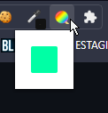

# :rainbow: Rainbow Background

> DISCLAIMER: This is one of my first experiences coding an extension, it is simple and immature.

---
## Topics
- [How to install](#how-to-install)

- [How to use](#how-to-use)

- [How it works](#how-it-works)

- [To Do](#to-do)

---
## How to install:
1. Download the extension via [GitHub](#) or add it on [Chrome Web Store](#).

1. Click on the :jigsaw: (top right corner) and verify if `Rainbow Background` shows. 

1. Click on the :pushpin: to fix the extension. 

_You're done! :tada:_

---
## How to use:
1. Click on the the icon 

1. It should popup a purple button. 

1. Click on the button to toggle the rainbow effect. 

_You're done! :tada:_

---
## How it works:
TO BE DEVELOPED

---
## To Do:
- [ ] Change text color with opposite color of rainbow (negative).

- [ ] Make actual `options` (random color, rainbow text).

- [ ] Change not only `body` color.

- [ ] Create icons.

- [ ] Finish `README.md`.

- [ ] Publish extension on [Chrome Web Store](https://chrome.google.com/webstore/category/extensions).
